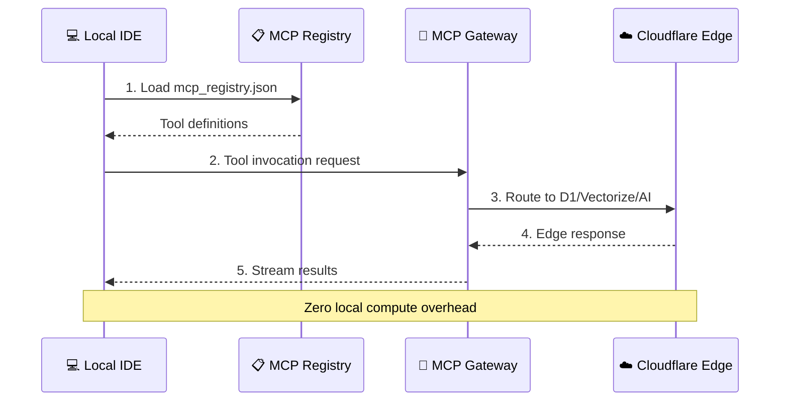

# 🏛️ ELEN_GALAXIA: Architecture & Philosophy

## 🌌 The "Hardware-Zero" Objective

**ELEN_GALAXIA** is not just a repository; it is a **Global Personal Standard** designed to decouple development productivity from physical hardware limitations.

### 🧩 The "Why"

Traditional development stacks rely on local overhead: Docker containers for databases, local LLM runtimes, and heavy Node.js processes. On a machine with limited specs (e.g., i3, 4GB RAM), this local overhead consumes the very resources needed for the IDE and reasoning.

**The Solution:** Offload the entire infrastructure to the **Edge**.

---

## 🗺️ The "How": Integrated Edge Stack

We leverage the **Cloudflare Ecosystem** combined with **MCP (Model Context Protocol)** to create a transparent bridge between your local IDE and global compute.

```mermaid
graph TD
    subgraph "Local Environment (Hardware-Zero)"
        IDE["AgentIC / VSCode"]
        MCP_Registry["mcp_registry.json"]
    end

    subgraph "The Global Edge (Cloudflare)"
        D1[("Cloudflare D1 (SQL)")]
        Vectorize[("Vectorize (Search)")]
        Workers_AI["Workers AI (Inference)"]
        R2[("R2 (Storage)")]
    end

    IDE <--> MCP_Registry
    MCP_Registry <--> Workers_AI
    MCP_Registry <--> D1
    MCP_Registry <--> Vectorize
    
    style Local Environment (Hardware-Zero) fill:#1a1a1a,stroke:#333,stroke-width:2px,color:#fff
    style The Global Edge (Cloudflare) fill:#0051c3,stroke:#fff,stroke-width:2px,color:#fff
```

### 📍 The "Where" (Data Residency)

- **State & Identity:** Stored in Cloudflare D1 (Global distribution).
- **Knowledge & Memory:** Managed by Vectorize.
- **Computation:** Distributed across 300+ Edge locations via Workers.
- **Local Proxy:** Managed via `mcp-gateway` for secure tunneling.

---

## ⏳ The "When" (Operational Lifecycle)

1. **Initialization:** Inherit the global ruleset via `.nexusrules`.
2. **Discovery:** The Agent reads `mcp_registry.json` to understand available tools.
3. **Execution:** Actions are dispatched to the Edge; results are streamed back to the IDE.
4. **Maintenance:** Infrastructure is managed via Terraform/OpenTofu (future) or Wrangler commands.



---

## 🚀 Use Cases: Infinite Scale on a Laptop

### 1. Multi-Agent Orchestration

Run 5+ specialized agents simultaneously without heating up your CPU. The orchestrator lives on a Cloudflare Worker, not your local process.

### 2. Universal Knowledge Base

Your "Memory" is not a local JSON file. It's a global Vector database synchronized across any machine where you open this repository.

### 3. Native AI Tools

Instead of running a local Ollama server (heavy RAM usage), the Agent calls **Workers AI** directly via MCP, freeing up 8GB+ of RAM.

---

> "Your machine is just a window. The galaxy is your server." — *Development Philosophy 2026*
