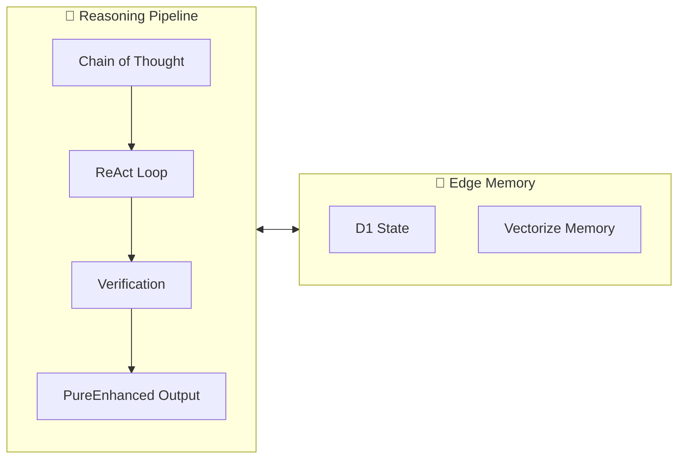

# 🌌 ELEN_GALAXIA: Personal Edge Architecture


> **Global SOTA 2025/2026 Configuration & Strategy**
> **Objective:** Zero-Hardware Overhead Architecture for Universal Intelligence.

[](LICENSE)
[](https://workers.cloudflare.com/)
[](https://modelcontextprotocol.io/)

---

## 🏛️ Project Vision

**ELEN_GALAXIA** is the extraction of a master infrastructure strategy. It provides a "Hardware-Zero" blueprint where your local machine acts only as a thin-client (IDE), while all state, memory, and high-performance compute live on the Global Edge.

By decoupling intelligence from local hardware, we achieve **Infinite Scale on a Laptop**.

[**📖 Read the Full Architecture Guide**](ARCHITECTURE.md)

---

## 🚀 Key Features

- **⚡ Hardware-Zero Execution:** Shift compute-heavy tasks (AI, DB, Vector Search) to Cloudflare's global network.
- **🧠 Global Memory:** Shared vector storage via Cloudflare Vectorize, accessible from any device.
- **🔗 MCP Native:** Pre-configured Model Context Protocol servers for zero-token tool discovery and integration.
- **🛡️ "Dark Mode" Security:** Zero Trust infrastructure with no public ingress. Services are accessed via secure tunnels or Service Bindings.
- **🔮 Future-Proof:** Designed for the 2026 SOTA efficiency stack.

---

## 📊 Comparison: Legacy vs. SOTA

| Component | Local (Legacy) | **ELEN_GALAXIA (Edge)** |
|-----------|----------------|----------------------------|
| **Database** | SQLite (Local File) | **Cloudflare D1** (Serverless SQL) |
| **Vectors** | Docker / Pinecone | **Cloudflare Vectorize** (Edge Native) |
| **AI Models** | Local GGUF (8GB+ RAM) | **Workers AI** (Global Inference) |
| **Compute** | Node/Python Process | **Cloudflare Workers** (Isolate Model) |
| **Security** | Firewall Rules | **Cloudflare Zero Trust** (Identity Aware) |

---

## 🛠️ The 2026 SOTA Stack

We utilize a hybrid reasoning pipeline that preserves context efficiency while maximizing exploratory depth. This follows the **PureEnhanced** methodology:

```text
                                    ┌──> [Global Edge Memory]
                                    │
≅( Ψ ├ [ → CoT 🔄 ReAct ↻ ∆ ♻️ Verify ] ⛓️ ∞ Output PureEnhanced )
     │
     └──> [Quantum Branching Strategy]
```

### 🔬 Technical Breakdown

| Component | Technology | Efficiency Gain |
|-----------|------------|-----------------|
| **Context Compression** | LLMLingua-2 Hybrid | **25x** token reduction |
| **Reasoning Pipeline** | CoT + ReAct Loops | **3x** accuracy improvement |
| **Quantum Branching (Ψ)** | Fork/Merge Orchestration | **Parallel hypothesis exploration** |
| **Edge Inference** | Workers AI (LLAMA-3.3-70B) | **0ms cold start** |
| **Vector Search** | Cloudflare Vectorize | **<10ms P99 latency** |

### 🧬 Reasoning Pipeline Components

- **Ψ (Quantum Branching):** Exploratory reasoning paths that can fork and merge, managed by the Orchestrator. Enables parallel hypothesis testing without blocking the main inference thread.
- **⛓️∞ (Recursive Orchestration):** Self-improvement loops where agents evaluate, critique, and refine their own outputs until convergence.
- **📦~ (LLMLingua-2):** Hybrid context compression achieving 25x reduction while preserving semantic fidelity. Critical for staying within token windows on complex tasks.
- **🔄 ReAct Loops:** Interleaved reasoning and action cycles that ground the agent in real-world tool outputs.
- **♻️ Verification Gates:** Each reasoning step passes through a verification layer before proceeding.



---

## 💡 Use Cases

### 1. Multi-Agent Orchestration

Run 5+ specialized agents simultaneously without heating up your CPU. The orchestrator lives on a Cloudflare Worker, not your local process. Your IDE simply streams the results.

```typescript
// The orchestrator runs on the Edge, not your machine
const agents = await orchestrator.spawn([
  { role: "researcher", task: "Find latest API specs" },
  { role: "analyst", task: "Evaluate cost/benefit" },
  { role: "writer", task: "Draft documentation" },
]);

// Results stream back to your IDE in real-time
const synthesis = await orchestrator.synthesize(agents);
```

### 2. Universal Knowledge Base

Your "Memory" is not a local JSON file. It's a global Cloudflare Vectorize index, synchronized across any machine where you open this repository.

```typescript
// Store a memory on your laptop...
await mcp.tools.vectorize.store({
  content: "Critical insight from code review",
  metadata: { project: "ELEN_GALAXIA", timestamp: Date.now() }
});

// ...retrieve it from your phone, tablet, or any device
const memories = await mcp.tools.vectorize.query({
  query: "What did I learn about the architecture?",
  limit: 5
});
```

### 3. Native AI Tools Integration

Instead of running a local Ollama server (heavy RAM usage), the Agent calls **Workers AI** directly via MCP, freeing up system resources for what matters: your flow state.

```typescript
// No local GPU needed - Workers AI at the edge
const analysis = await mcp.tools.ai.run({
  model: "@cf/meta/llama-3.3-70b-instruct-fp8-fast",
  prompt: "Analyze this codebase for security vulnerabilities",
  context: await mcp.tools.vectorize.query({ query: "security patterns" })
});
```

---

## 📁 Repository Structure

```text
.
├── global-config/           # 💎 THE SOURCE OF TRUTH
│   ├── mcp_registry.json    # Standardized MCP Tools definition
│   └── secrets.json         # (Ignored) Sensitive credentials
│
├── servers/                 # 🛰️ Local & Edge MCP Wrappers
│   └── agent-cgi/           # Rust-based CGI for Agents
│
├── mcp-gateway/             # 🌉 Bridge between IDE and Edge
│   ├── src/                 # Worker entry points
│   └── wrangler.toml        # Deployment configuration
│
└── resources/               # 🧱 Terraform/OpenTofu definitions
```

---

## 🏁 Getting Started

### Prerequisites

- [Node.js](https://nodejs.org/) (v20+)
- [Cloudflare Wrangler](https://developers.cloudflare.com/workers/wrangler/install-and-update/) (`npm install -g wrangler`)
- A Cloudflare Account

### Installation

1. **Clone & Bind:**

   ```bash
   git clone https://github.com/LERMF/ELEN_GALAXIA.git
   cd ELEN_GALAXIA
   ```

2. **Setup Credentials:**

   Copy the template and fill in your Cloudflare Account ID and API Token.

   ```bash
   cp global-config/secrets.json.template global-config/secrets.json
   ```

3. **Install Dependencies:**

   ```bash
   cd mcp-gateway
   npm install
   ```

4. **Register MCP:**

   Point your AgentIC (or compatible IDE) to the `global-config/mcp_registry.json` path. This will auto-load the edge tools.

---

## 📜 License

Distribute freely under the **MIT License**.
Created by [LERMF](https://github.com/LERMF).
